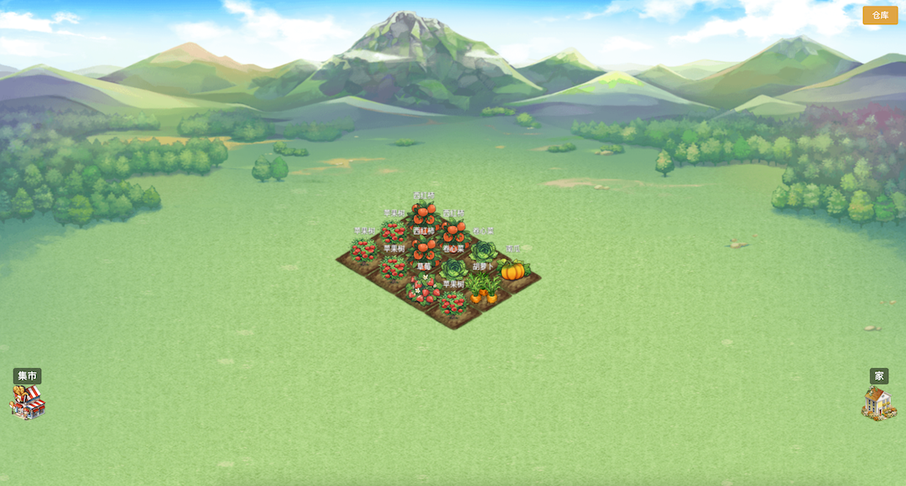
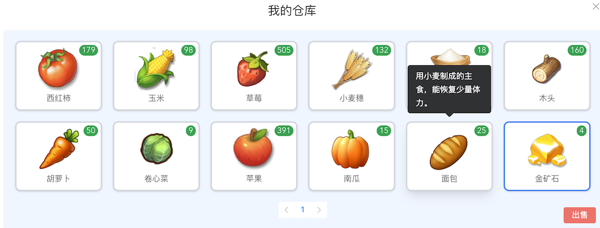
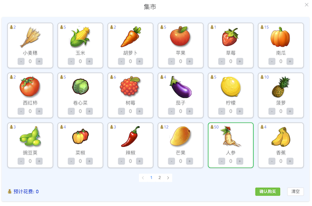
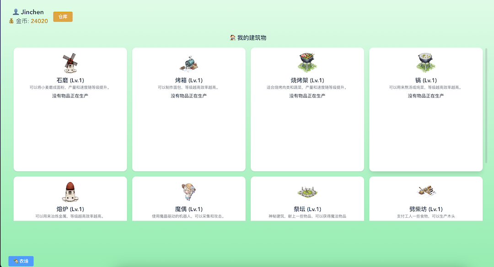

# VueFarmGame

[](https://www.gnu.org/licenses/agpl-3.0)

**许可证声明**  
本项目采用 **GNU Affero General Public License v3.0 (AGPLv3)**。  
- ✅ 允许：自由使用、修改、分发  
- 🔄 要求：衍生作品必须开源并保持相同许可证  
- 🌐 网络服务：若提供基于本项目的在线服务，必须公开修改后的源代码

**网络服务特别说明** 

若你将本项目用于提供在线服务（如 Web API、SaaS 平台），必须：
- 向所有用户公开修改后的源代码  
- 在服务显著位置提供源码获取方式（如页面底部链接）


**⚠️补充说明**  
本项目使用的图片资源来源于互联网，仅供学习与研究使用，不涉及商业用途。

VueFarmGame：一个基于 **Vue3 + Phaser** 开发的农场模拟游戏。
玩家可以体验种植、收获、背包管理、商店交易以及家园建设等玩法。

## ✨ 功能特性

* 🌱 **种植系统**

  * 播种、成长、收获完整流程
  * 不同作物拥有各自的成长周期

* 🧺 **背包系统**

  * 查看和出售已有物品
  * 支持数量堆叠

* 🏪 **商店系统**

  * 购买物资

* 🏡 **家园系统**

  * 丰富的生产建筑
  * 存档与加载机制

* 🎮 **交互体验**

  * 采用 **Phaser** 实现流畅的 2D 动画与碰撞逻辑
  * 使用 **Vue3** 构建 UI（背包、商店、菜单等）
  * **TailwindCSS** 提供快速样式开发和响应式布局
  * **Element Plus** 作为 UI 组件库，提升交互体验（对话框、菜单、表单等）

## 🛠 技术栈

* [Vue3](https://vuejs.org/) — 前端框架
* [Phaser](https://phaser.io/) — 2D 游戏引擎
* [TailwindCSS](https://tailwindcss.com/) — 原子化 CSS 框架
* [Element Plus](https://element-plus.org/) — Vue3 组件库

## 📦 本地运行

```bash
# 克隆项目
git clone https://github.com/yourname/farm-game.git

# 进入目录
cd farm-game

# 安装依赖
npm install

# 启动开发服务器
npm run dev

# 打包
npm run build
```


## 📂 项目结构

```

farm-game/
├── src/
│   ├── assets/       # 游戏资源（图片、地图等）
│   ├── components/   # Vue3 组件（菜单、背包等窗口）
│   ├── game/         # Phaser 游戏逻辑
│   ├── store/        # 状态管理（背包、金钱等）
│   ├── view/         # 游戏场景（种植、商店、家园等）
│   ├── config/       # 开发配置（全局常量、环境变量等）
│   ├── route/        # 路由配置
│   └── App.vue       # 应用入口
├── public/           # 公共资源
├── package.json      # 项目依赖与脚本
└── vite.config.js    # Vite 配置文件

```


## 🚀 开发进度

* [x] 种植与收获
* [x] 背包系统
* [x] 商店交易
* [ ] 家园扩展（开发中）
* [ ] 更多作物与任务系统


